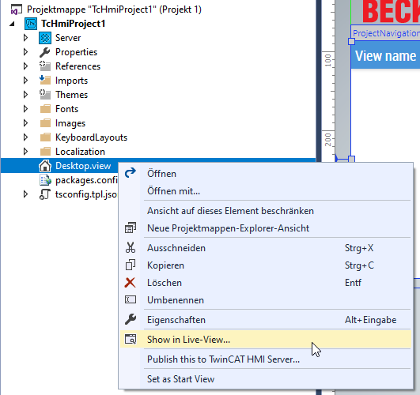
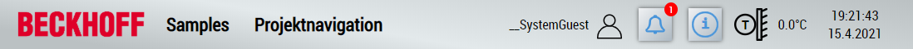
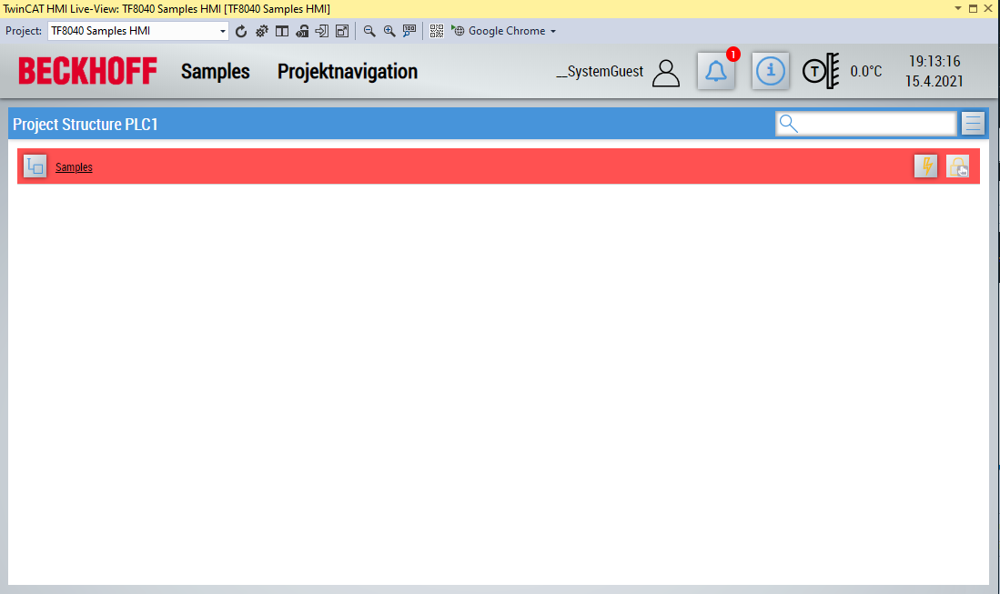
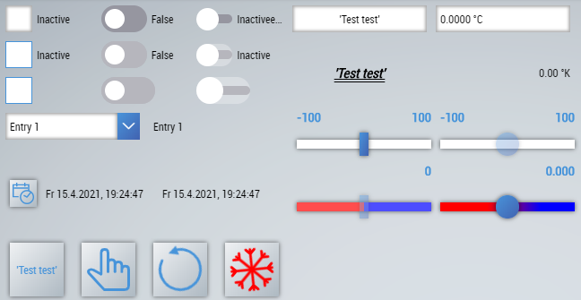
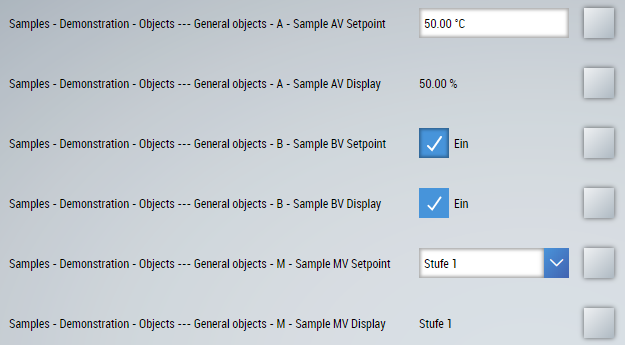
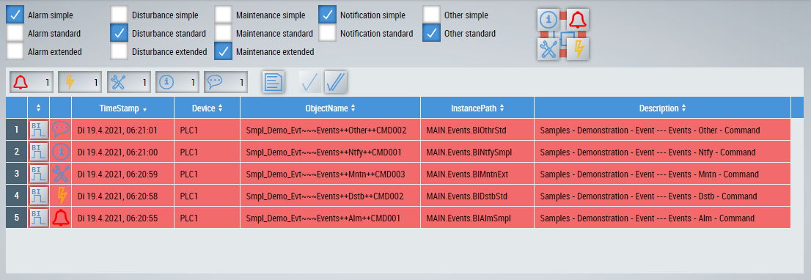
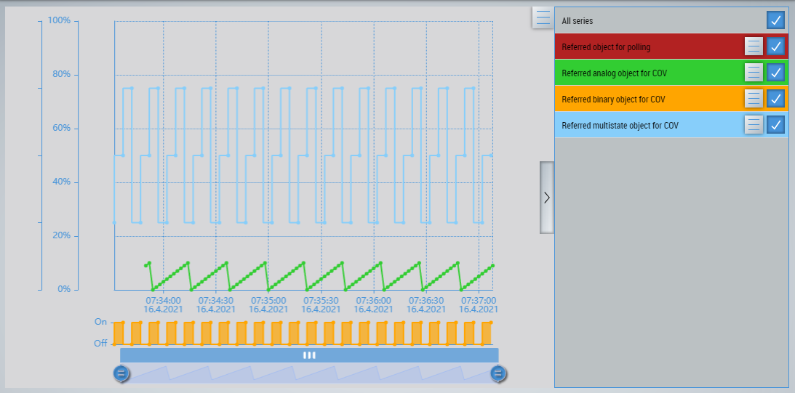
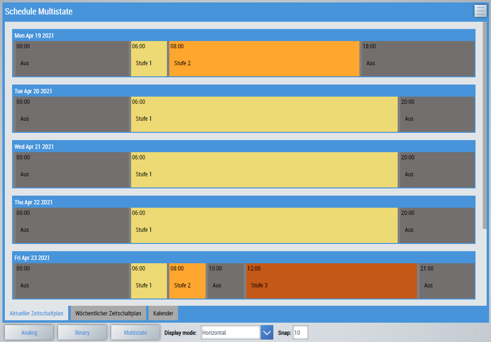
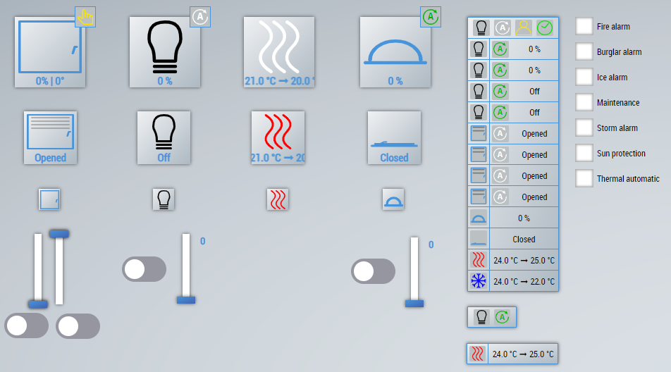
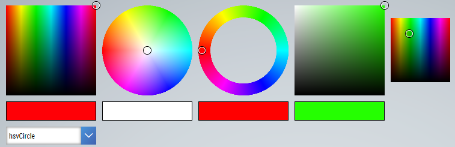

# HMI
Explanation of the sample project *TF8040-Concept-Samples-HMI*.

> **INFO**
For more information on the required steps, refer to the sample documentation in the [HMI](/README.md#hmi) section.

# Contents
The individual sample pages of the project are described below. It is advisable to open the live view in order to be able to follow the execution more easily.

## Header
The header is provided with various functions (from left to right).

- Logo
- Responsive navigation
- User settings and further information
- Event list
- Building information
- Outdoor temperature
- Date and time

> **INFO**
Further information on the functions can be found in the documentation for the [header](https://infosys.beckhoff.com/english.php?content=../content/1033/tf8040_tc3_buildingautomation/13615597451.html&id=).

## Project navigation
The generic project navigation was defined as the start page of the visualization. The content of the Live-View should look like this after the start:

In the project navigation, you can navigate through the project structure and display the parameters of individual views or objects.

> **INFO**
For more information on project navigation, see the documentation for [ProjectNavigationTextual](https://infosys.beckhoff.com/english.php?content=../content/1033/tf8040_tc3_buildingautomation/13610089995.html&id=).

The following pages are located under the entry *Content\Samples*.

## BasicComponents
This page displays all controls that are stored in the *BA | Common* toolbox category.

> **INFO**	
The controls are not linked to variables from the PLC.
Further information can be found in the documentation for [controls](https://infosys.beckhoff.com/english.php?content=../content/1033/tf8040_tc3_buildingautomation/13574982795.html&id=).

## BaObjects
On this page, a corresponding control is stored for each primitive data type (*Analog*, *Binary* and *Multistate*).

The controls are connected to objects from the PLC and the values are written to the PLC and read again.

The following information is displayed per line:
- The *Description* of the object.
- The value of the object (writable or read-only).
- Button to open the project navigation of the object (only one entry is visible, because single objects are concerned).

## Events
The simulation of the different event types is possible on this page.

The respective event can be activated via the checkboxes and the behavior can be observed in the event list below. A *UiIcon* to display the events is also positioned on the page. The view containing the sample events is linked to both the event list and the *UiIcon*. Therefore, no events outside the view are displayed on this page.

## Trend
This page shows the trend control for displaying various trend curves.

In this case, the complete project structure was linked to the control. This filters the project structure for all available trends and displays them. You can select and deselect trends on the right-hand side.

> **INFO**	
For more information, see the documentation on [Trend](https://infosys.beckhoff.com/english.php?content=../content/1033/tf8040_tc3_buildingautomation/13611078667.html&id=).

## Schedule
The schedule displays the *current schedule* and the *weekly schedule*. The *Calendar* tab contains the entries from the linked calendar references and the local exceptions.

The buttons at the bottom of the page allow you to switch to other schedule types. In addition, the alignment and accuracy of the schedule can be set.

> **INFO**	
For more information, see the documentation on the [Schedule](https://infosys.beckhoff.com/english.php?content=../content/1033/tf8040_tc3_buildingautomation/13610943883.html&id=).

## RoomAutomation
The following list shows the available controls for room automation:
| Control | Description |
|--|--|
| [*Sunblind*](https://infosys.beckhoff.com/english.php?content=../content/1033/tf8040_tc3_buildingautomation/13600099595.html&id=) | Displays and controls the position and angle of a sunblind. |
| [*Light*](https://infosys.beckhoff.com/english.php?content=../content/1033/tf8040_tc3_buildingautomation/13596586891.html&id=) | Displays and controls the brightness value of a lamp (dimmable or on / off). |
| [*HeatingCooling*](https://infosys.beckhoff.com/english.php?content=../content/1033/tf8040_tc3_buildingautomation/13596585739.html&id=) | Displays and controls the air conditioning of a room. |
| [*Window*](https://infosys.beckhoff.com/english.php?content=../content/1033/tf8040_tc3_buildingautomation/13599620235.html&id=) | Shows and controls the position of a window (percentage or open/close). |
| [*RoomControl*](https://infosys.beckhoff.com/english.php?content=../content/1033/tf8040_tc3_buildingautomation/13601244171.html&id=) | This control can combine all of the above controls. |

> **INFO**	
The controls are for demonstration purposes only and are therefore not linked to variables from the PLC.

## ColorPicker
On this page, ColorPicker is shown in its different versions.

> **INFO**	
Further information can be found in the documentation for the [ColorPicker](https://infosys.beckhoff.com/english.php?content=../content/1033/tf8040_tc3_buildingautomation/13623247499.html&id=).

