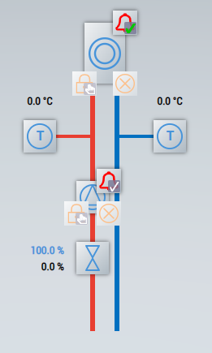
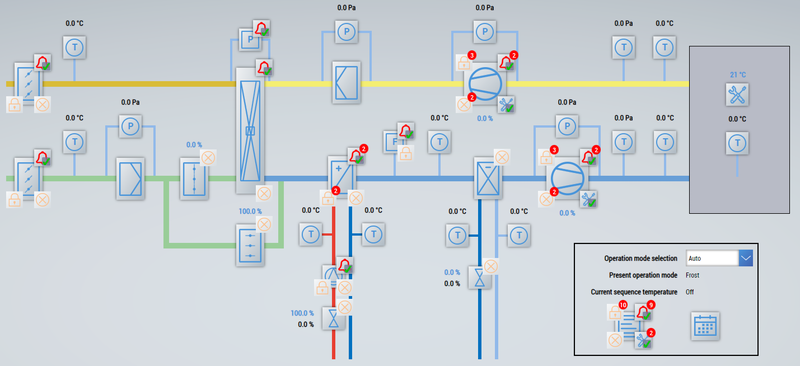
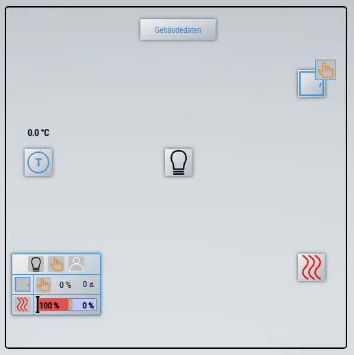

[[_TOC_]]

# HMI
Explanation of the sample project *TF8040 Template Samples HMI*.

> **INFO**
For more information on the required steps, refer to the sample documentation in the [HMI](/README.md#hmi) section.

# Components
The individual sample pages of the project are described below.

> **INFO**	
The open live view shows many errors. This is because objects in the PLC signal an error if no physical inputs are connected.

## Projektnavigation
The [generic navigation](https://infosys.beckhoff.com/english.php?content=../content/1033/tf8040_tc3_buildingautomation/13610089995.html&id=) is displayed on the content of this page.

## Plants

### Heating circuit
Displays a heating circuit.

### Air handling unit
Displays an ait handling unit.

### Room
Displays a sample room.

