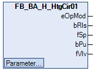
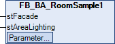

# PLC
Explanation of the procedure for starting the sample project TF8040 Template Samples PLC and its contents.

# Contents
The individual templates used in the project are described below.

## Heating circuit
Use of the template [FB_BA_H_HtgCir01](https://infosys.beckhoff.com/english.php?content=../content/1033/tf8040_tc3_buildingautomation/14973860619.html&id=).

## AHU
Use of the template [FB_BA_AHU_1st_10](https://infosys.beckhoff.com/english.php?content=../content/1033/tf8040_tc3_buildingautomation/12421959435.html&id=).

## Room sample
Use of the template [FB_BA_RoomSample1](https://infosys.beckhoff.com/english.php?content=../content/1033/tf8040_tc3_buildingautomation/13789756555.html&id=).

